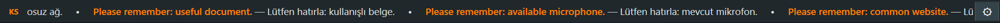
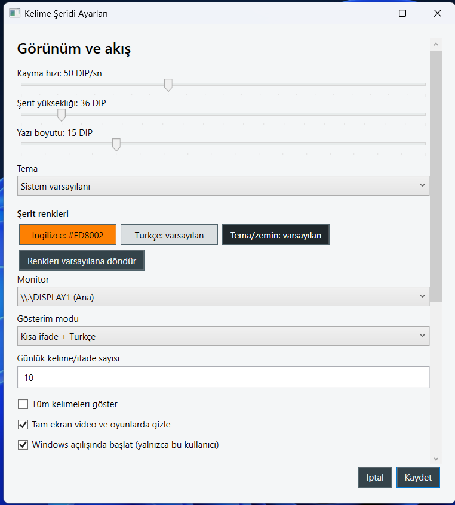

# Kelime Şeridi

Kelime Şeridi, Windows masaüstünün üst kenarında çalışan çevrimdışı bir İngilizce kelime uygulamasıdır. Çalışırken ekranın çalışma alanını koruyan ince bir şerit gösterir; kelime ve Türkçe karşılığını gün boyunca tekrar etmenize yardımcı olur.





> Ekran görüntüleri uygulamanın gerçek arayüzünü gösterir. Şerit, Windows’ta ekranın en üstünde uygulama çubuğu olarak yer alır.

## Ne işe yarar?

- İngilizce kelimeleri ve Türkçe karşılıklarını üst şeritte akıtır.
- Kelimeye tıklayınca örnek cümle, telaffuz, favori, **Öğrendim** ve **Tekrar et** seçeneklerini sunar.
- Günlük çalışma grubu, tekrar önceliği ve öğrenme ilerlemesini yerelde saklar.
- Kendi kelimelerinizi aynı satırlarda eşleştirilmiş İngilizce/Türkçe `.txt` dosyalarından ekler.
- Tema, renk, şerit yüksekliği, yazı boyutu, hız, monitör, kategori ve gösterim modunu ayarlamanıza izin verir.
- Sistem tepsisinden göster/gizle, duraklat/devam ettir, kelimeleri yönet ve çık seçenekleri sunar.
- Ağ bağlantısı, üyelik, sunucu veya ücretli API gerektirmez.

## Gereksinimler

- Windows 10 veya Windows 11 (64 bit)
- Kaynak koddan çalıştırmak için [.NET 8 SDK](https://dotnet.microsoft.com/download/dotnet/8.0)

Hazır kurulum paketini kullananlar için ayrıca .NET kurulumu gerekmez; paket kendi çalıştırma bileşenlerini içerir.

## Kurulum

1. GitHub’daki **Releases** sayfasından `KelimeSeridi-Kurulum.exe` dosyasını indirin.
2. Dosyayı çalıştırın ve Windows’un yönetici onayını kabul edin.
3. Kurulum konumunu onaylayın. Uygulama `C:\Program Files\Kelime Şeridi` klasörüne kurulur.
4. Kurulum bittiğinde uygulama otomatik açılır; sonraki açılışlarda Başlat menüsündeki **Kelime Şeridi** kısayolunu kullanın.

Uygulama, varsayılan olarak Windows açıldığında başlamaz. Bunu açmak için şeritteki **⚙ Ayarlar** düğmesini açıp **Windows açılışında başlat** seçeneğini işaretleyin.

## Kullanım

Şerit açıldığında kelimeler ekranın üstünde akar. Bir kelimeye tıklayarak ayrıntı penceresini açın:

- **Dinle:** İngilizce telaffuzu dinletir.
- **Öğrendim:** Kelimeyi öğrenilmiş olarak işaretler.
- **Tekrar et:** Kelimeyi tekrar önceliğine alır.
- **Favori:** Kelimeyi favorilerinize ekler veya çıkarır.

Şeritteki **⚙** düğmesi ayarları açar. Sistem tepsisindeki Kelime Şeridi simgesinin menüsünden şeridi gizleyebilir, duraklatabilir, kelime listenizi yönetebilir veya uygulamadan çıkabilirsiniz.

### Kendi kelimelerini ekleme

Ayarlar ekranındaki iki dosya seçicisinden bir İngilizce, bir Türkçe `.txt` dosyası belirleyin. Dosyalarda her satır bir kelime/ifade olmalı ve karşılık gelen satırlar birbirini açıklamalıdır:

```text
İngilizce dosyası     Türkçe dosyası
apple                 elma
good morning          günaydın
```

Boş satırlar yok sayılır. Dosyalardaki geçerli satır sayıları aynı olduğunda **Eşleşen kelimeleri ekle** düğmesi etkinleşir.

## Kaldırma

1. Windows’ta **Ayarlar > Uygulamalar > Yüklü uygulamalar** bölümünü açın.
2. **Kelime Şeridi** kaydını bulun ve **Kaldır** seçeneğini seçin.
3. Kaldırma yardımcısındaki onayı verin.
4. İsterseniz kaldırma sırasında ayarlarınızı, kişisel kelimelerinizi ve öğrenme ilerlemenizi de silebilirsiniz.

Başlangıç kaydı ve Başlat menüsü kısayolu kaldırma sırasında otomatik temizlenir.

## Kaynak koddan çalıştırma

Depoyu klonlayın ve proje kökünde PowerShell açın:

```powershell
git clone https://github.com/cumakaya0000/KelimeSeridi.git
cd KelimeSeridi
dotnet restore .\KelimeSeridi.sln
dotnet build .\KelimeSeridi.sln -c Release
dotnet run --project .\src\KelimeSeridi\KelimeSeridi.csproj
```

Otomatik mantık testleri:

```powershell
dotnet run --project .\tests\KelimeSeridi.Tests\KelimeSeridi.Tests.csproj -c Release
```

Windows x64 için bağımsız yayın paketi üretmek:

```powershell
dotnet publish .\src\KelimeSeridi\KelimeSeridi.csproj -c Release -r win-x64 --self-contained true -p:PublishSingleFile=true
```

## Veri ve gizlilik

Uygulama verileri `%LocalAppData%\KelimeSeridi` altında JSON dosyaları olarak saklanır. Bunlar ayarlarınızı, öğrenme durumunuzu, favorileri, günlük grubu ve kişisel kelimelerinizi kapsar. Kelime Şeridi çevrimdışı çalışır; veri toplamaz ve herhangi bir hesaba bağlanmaz.

## Geliştirme notları

Proje WPF ve `.NET 8` ile yazılmıştır. Harici NuGet paketi kullanmaz. Derleme çıktıları ile yayın/kurulum dosyaları kaynak depoya eklenmez; sürüm paketleri GitHub Releases üzerinden dağıtılmalıdır.
